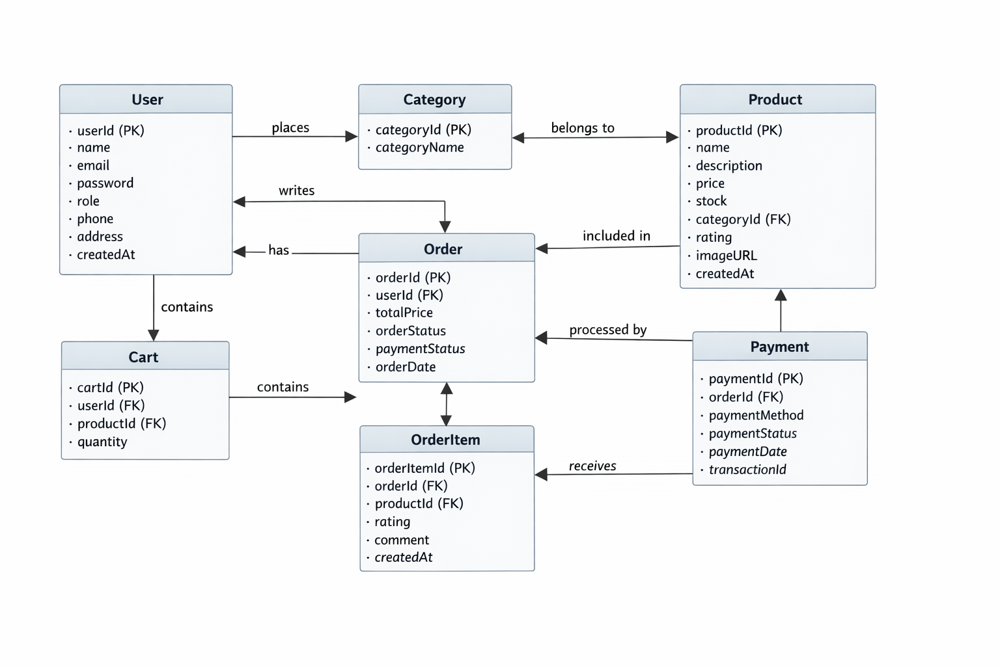
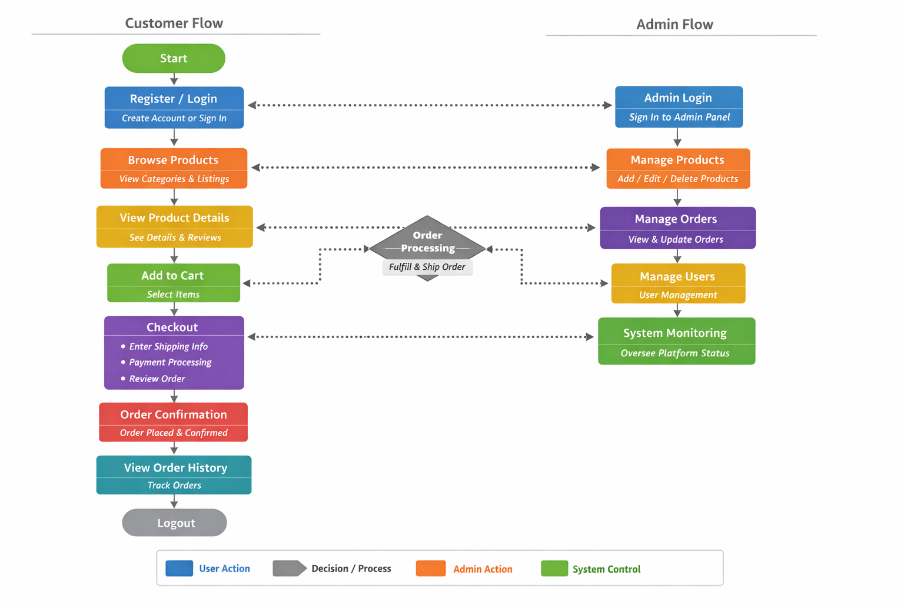

# ShopEZ

ShopEZ is a full-stack e-commerce platform built using the MERN stack (MongoDB, Express.js, React.js, Node.js). The platform provides a seamless online shopping experience where users can browse products, manage shopping carts, place orders, and review products. Administrators are provided with tools to manage products, monitor orders, and maintain the platform.

---

## Tech Stack

Frontend
React.js (Vite), HTML, CSS, JavaScript

Backend
Node.js, Express.js

Database
MongoDB

Authentication
JSON Web Tokens (JWT), bcrypt

Communication
RESTful APIs using Axios

---

## System Architecture

The platform follows a layered MERN architecture where the React frontend communicates with the Express backend through REST APIs, and MongoDB manages the persistent data storage.

---

## ER Diagram

The ER model defines the core entities such as users, products, orders, reviews, and payments that form the backbone of the e-commerce platform.

---

## User Flow

The user flow describes how customers interact with the system, starting from account registration or login to browsing products, adding items to the cart, completing checkout, and viewing order history.

---

## Documentation

* [Technical Architecture](docs/technical_architecture.md)
* [ER Model](docs/er_model.md)
* [Features](docs/features.md)
* [Roles and Responsibilities](docs/roles_and_responsibilities.md)
* [User Flow](docs/user_flow.md)
* [MVC Pattern](docs/mvc_pattern.md)

---

## Project Structure

smartbridge project
│
├── README.md
└── docs
    ├── technical_architecture.md
    ├── er_model.md
    ├── features.md
    ├── roles_and_responsibilities.md
    ├── user_flow.md
    ├── mvc_pattern.md
    ├── ER_diagram.png
    ├── Technical Architcture Diagram.png
    └── User_Flow_Diagram.png

---

## Future Enhancements

* Product search and filtering
* Payment gateway integration
* Real-time order tracking
* Admin analytics dashboard
* Product recommendation system
