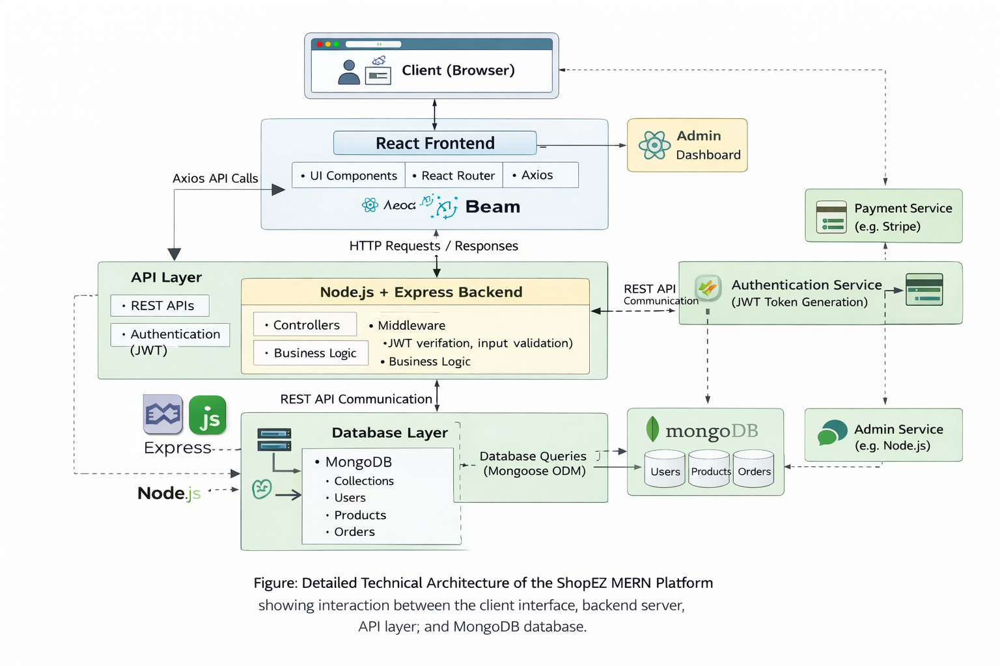

Technical Architecture
The ShopEZ platform follows a MERN stack architecture consisting of MongoDB, Express.js, React.js, and Node.js. The architecture is divided into multiple layers to ensure scalability, modularity, and efficient data handling.
1. Client Layer (Frontend)
The client layer is built using React.js and is responsible for rendering the user interface and handling user interactions.
Key responsibilities:
•	Display product listings
•	Manage user authentication interface
•	Handle shopping cart interactions
•	Display order history and tracking
•	Communicate with backend APIs using Axios
React Router is used to manage navigation between different pages such as home, login, product details, and checkout.
________________________________________
2. Application Layer (Backend)
The backend is built using Node.js and Express.js. This layer handles the core business logic of the application.
Key responsibilities:
•	User authentication and authorization
•	Processing orders and payments
•	Managing product inventory
•	Handling cart operations
•	Admin product moderation
Express.js is used to build RESTful APIs that allow the frontend to communicate with the server.
________________________________________
3. API Layer
The API layer acts as the communication bridge between the frontend and backend.
Key responsibilities:
•	Receiving HTTP requests from the frontend
•	Processing requests through controllers
•	Sending responses back to the client
•	Managing secure authentication using JWT tokens
All client requests such as login, product retrieval, and order placement are handled through REST APIs.
________________________________________
4. Database Layer
The database layer uses MongoDB to store and manage application data.
Key responsibilities:
•	Storing user information
•	Managing product catalog data
•	Storing order and payment records
•	Maintaining product reviews and ratings
MongoDB provides flexible schema design which allows efficient handling of e-commerce data.

## Technical Architecture Diagram

